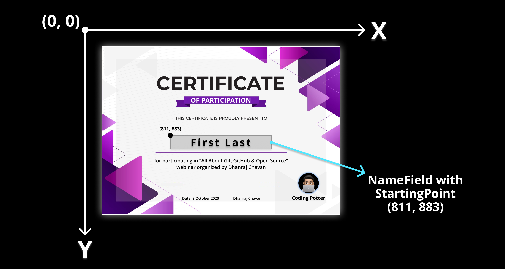

  

# Welcome to Certificate Launchpad

Automatically Send Custom Named Certificates via Email

  

# Intro
After any event, sending certificates to attendees or participants is very frustrating & difficult task. So, this is where Certificate Launchpad comes in! Certificate Launchpad simplifies the process of sending Bulk Custom Certificates to Bulk Emails of Participants. 

# Demo

# Getting Started
- Fork this project 
- Suggested to use: `PyCharm IDE`
- Download & Install all dependencies from `requirements.txt`

# Setting Up Gmail
- `Sign In` -> Select `Manage your Google Account` -> Go to `Security` -> Turn on `Less secure app access`
- Add your Email ID & Password in `main.py`
- SMTP Gmail Daily Limit - 1000
- Add `Subject` & `Body` in `main.py`

# Data
- Add Attendees/Participant Data in Excel Sheet in above format & Modify Name of file in `main.py`

| NAME | EMAIL |
| ---- | ----- |
| Dhanraj Chavan | dc6707914@gmail.com |

# Certificate Template
- Import your Certificate Template to project directory
- Rename template name Or Change template name in `main.py`

# Adding Name to Certificate

- Identify the `Starting Point` in your Certificate Template & Add it in `main.py`
- If the name length is larger than 20, then the name will be converted in shorten form.

# All Set
- Run the code to send certificates to mails
- Wrong or Incorrect emails will be printed at the end

# Questions?

# Want to Contribute?

# Enjoying this Project? 
If you like this project & you want to support, buy me a coffee

# Project Admin

